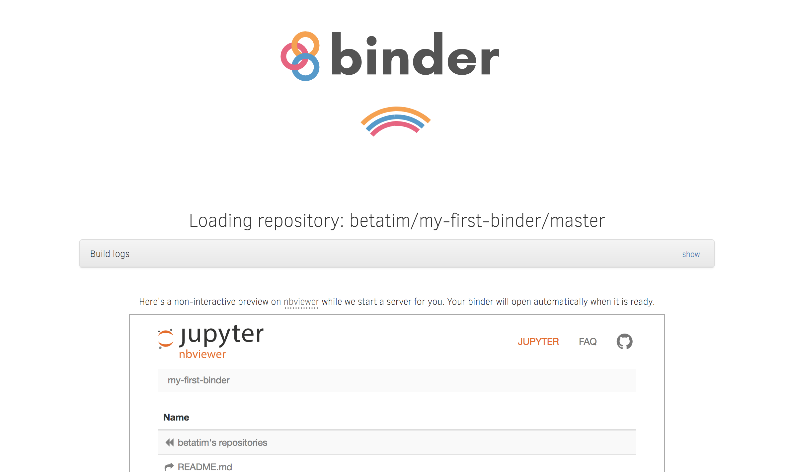
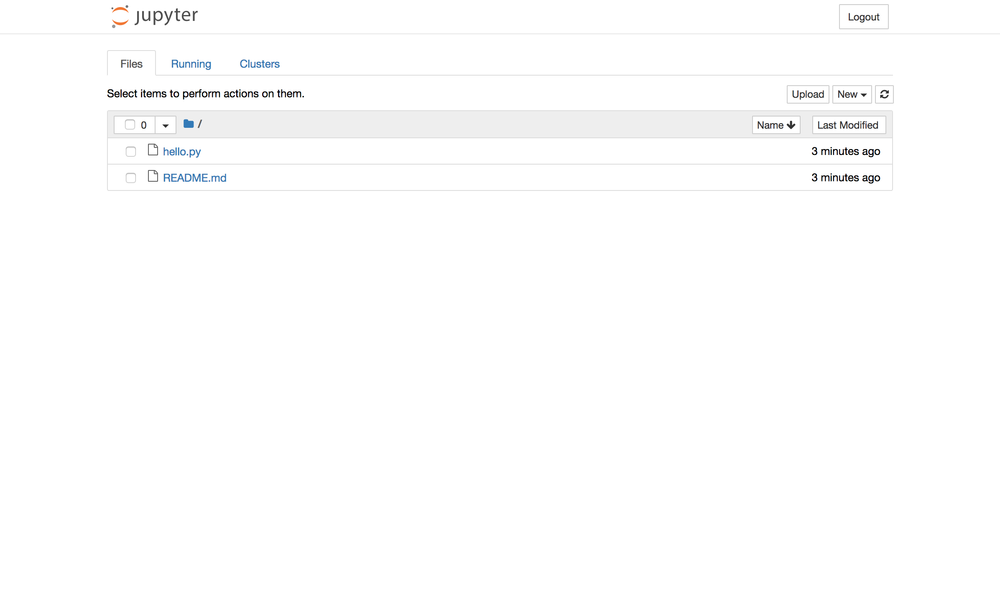

# From Zero to Binder!

This document will walk you through taking a repository containing Python
code and adding to it to make it runnable with a service like mybinder.org.

One of the big hurdles to trying out other people's code is reproducing the
exact environment that the code requires to run. Writing instructions that
are correct for all possible cases is very hard. As a user applying imperfect
instructions to your particular setup is very hard. Often it is also not clear
where the "bug" is when things don't work. Should the instructions have mentioned
that setting that obscure environment variable to an obscure value would break
the instructions? Should you as user have know this? And will either the author
or the user ever think of checking for obscure things like this?

One way to solve this is the approach BinderHub (the software behind
mybinder.org) takes. The authors provide machine-readable instructions for how
to construct the environment. A machine will execute these instructions and if
they do not work, it is clear the instructions need updating. The construction
of the environment starts from the same "base" for every possible project, which
makes it easier for users to help out with fixing the instructions.


## Creating a repository to "binderize"

To get started let's create a new repository that we can use during this
exercise to demonstrate how to "binderize" a repository.

What is "binderizing" a repo? A (not so great) name for creating the instructions
that BinderHub can understand to create the environment your code needs.

To do:

1. Head over to github.com and create a new repository called "my-first-binder"
1. Create a file called `hello.py` via the web interface with `print("Hello from Binder")`
  on the first line


## Launch your first repository

You just created a repository that is compatible with Binder! Before we explain
how this can be, head over to https://mybinder.org and see for yourself.

The interface you see on mybinder.org let's you specify the repository you want
to have started.

To do:

1. Type the URL of your repository into the "GitHub repo or URL" box (should be
    something like https://github.com/<YOURGITHUBNAME>/my-first-binder/)
1. As you type the URL the webpage will generate a link you can share with
   others in the "Copy the URL below..." box. It should look something like: https://mybinder.org/v2/gh/<YOURGITHUBNAME>/my-first-binder/master
1. Copy it, open a new tab and visit that URL

When you visit a URL like https://mybinder.org/v2/gh/<YOURGITHUBNAME>/my-first-binder/master
you will see a big spinner like this:



In the background several things are happening while you wait. BinderHub is:
* fetching your repository from github.com,
* analysing the contents of the repository,
* creating a Docker image based on what it finds,
* launching the newly created image for you in the cloud, and
* finally connecting you to it via your browser.

If everything went smoothly you should be greeted by a page that looks like
this:



One of the default dependencies that is installed for you is Jupyter which
provides this interface for you.

To see your code run click (on the far right next to the "Upload" and
"Last Modified" buttons) "New -> Terminal". This will open a new tab with a
terminal. To run your code type `python hello.py`.


## Using other libaries

It was easy to get started but so far the environment which is created is pretty
barebones. Let's add some dependencies.

The tool that analysis your repository to find what dependencies need to be
installed looks for files that are already in use by the respective programming
language communities. It checks for Python dependencies by looking for a
`requirements.txt` file.

To do:
1. in your repository on GitHub create a file called `requirements.txt`
1. add a line to `requirements.txt` that reads `numpy==1.14.5`
1. after adding the file and checking its name for typos
1. visit https://mybinder.org/v2/gh/<YOURGITHUBNAME>/my-first-binder/master again
  in a new tab

You will see the big spinner again. While the spinner is spinning click on the
big horizontal grey bar that reads "Build logs". It will unfold and let you watch
the progress of your container being built. Looking at this is useful when
your build fails or something you think should be installed does not get installed.

Once your repository launches you should be greeted by the now familiar file
browser view provided by Jupyter.

To check that Numpy was installed and is ready for use open a new notebook
(click New -> Python 3). Type the following code into a cell of the new notebook:

```
import numpy
numpy.random.rand()
```

If you run this cell you will see a random number printed out.


## Sharing your work

Binder is all about sharing your work. There are two ways to let others use
your repository on mybinder.org:

1. share the https://mybinder.org/v2/gh/<YOURNAME>/my-first-binder/master URL
  with people
1. visit https://mybinder.org, type in the URL of your repository and copy
  the Markdown or Restructure Text snippet. The snippet will render a nice
  badge that people can click

To do:
1. add the Markdown snippet to the README.md in your GitHub repository
1. click the badge to make sure it works


## Questions?

Brief pause for questions.


## Putting data into your Binder

So far we covered how to get software dependencies installed. Another kind of
dependency for projects is data. There are a few ways to make data available
in your Binder. Which is the best one depends on how big your data is and your
preferences for sharing data.

### Small public files

The simplest approach for small data files that are public is to add them directly
to your GitHub repository. This way they are directly baked into the environment
and versioned together with your code.

Works well for files with sizes up to maybe 10MB.

### Medium public files

For medium sized files, a few 10s of megabytes to a few hundred megabytes, you
can add a special file named `postBuild` to your repository.

To do:
1. go to your GitHub repository and create a file called `postBuild`
1. in your `postBuild` add a single line reading `wget -q -O gapminder.csv http://bit.ly/2uh4s3g`
1. in your `requirements.txt` add line with `pandas` on it to add the pandas
  library and one with `matplotlib` on it. This is not needed to get data, we are adding it because it is a good option for reading CSV files and making plots.
1. click the Binder badge

Once your Binder launches you should see that a new file that was not part
of your repository has appeared.

To see the data create a new notebook and use the below code to make a plot:
```
%matplotlib inline

import pandas

data = pandas.read_csv('gapminder.csv', index_col='country')

# Extract year from last 4 characters of each column name
years = data.columns.str.strip('gdpPercap_')
# Convert year values to integers, saving results back to dataframe
data.columns = years.astype(int)

data.loc['Australia'].plot()
```

The data and code snippet were taken from a [Software Carpentry lesson](https://swcarpentry.github.io/python-novice-gapminder/09-plotting/index.html).

The contents of the `postBuild` file is a shell script that is executed as part
of the container image construction. This means it is only executed once when
the image is built, not every time it is launched.

### Large public files

For large files it is not practical to place them in your GitHub repository nor
to include them directly in the image.

> Note: technically we can not stop you from including very large files in your
> image. However large images take longer to launch, as well as taking up
> storage space that mybinder.org has to pay for. Be considerate.

The best option for large files is to use a library specific to the data format
to stream the data as you are using it. Or if you have to download it on
demand as part of your code.

There are a few restrictions on outgoing traffic from your Binder that are
imposed by the team operating mybinder.org. Currently only connections to
HTTP and Git are allowed. This comes up when people want to use FTP sites to
fetch data. For security reasons FTP will never be allowed on mybinder.org.

> Note: to start a discussion of opening additional ports create a new issue
> on the [mybinder.org repository](https://github.com/jupyterhub/mybinder.org-deploy/)


### Private files

There currently is no way to access files which are not public from mybinder.org.

For security reasons you should consider all information in a Binder as public.
This means:
* there should be no secrets (passwords, tokens, keys, etc) in your
GitHub repository
* you should not type passwords into a running Binder on mybinder.org
* you should not upload your private SSH key or API token to a running Binder

To support access to private files you will have to create a local deployment
of [BinderHub](https://binderhub.readthedocs.io/) where you can then decide
on the security trade offs yourself.


## Beyond `requirements.txt`

There are a few more ways you can specify what dependencies to install. Take a
look at the complete list: http://repo2docker.readthedocs.io/en/latest/config_files.html


## Configuring what visitors see

You can influence what people who click your mybinder.org link see.

### Directly opening a notebook

You can direct your users directly to a notebook by adding an option to the URL:

XXXXX


### Using Jupyter lab

Jupyter lab is installed by default and you can switch to using it by changing
the URL you visit to: https://mybinder.org/v2/gh/<YOURNAME>/my-first-binder/master?urlpath=lab
